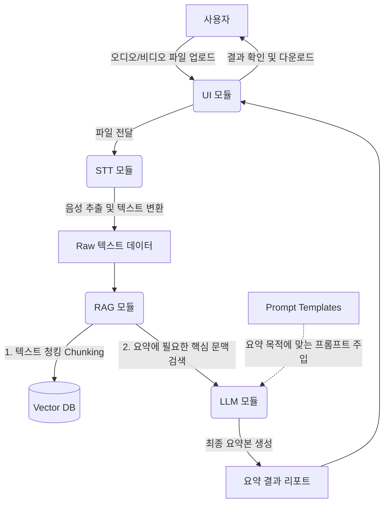

# 🎙️ LASS (Local AI Summarizer System)


**LASS(Local AI Summarizer System)**는 인터넷 연결 없이 노트북(로컬) 환경에서 독립적으로 구동되는 지능형 음성 요약 파이프라인입니다. 
회의, 강의, 인터뷰 등 긴 오디오/비디오 파일을 입력받아 텍스트로 변환하고, 사용자가 원하는 맞춤형 양식으로 핵심만 요약해 줍니다.

---

## 📌 프로젝트 기획 배경 및 특징

- **완벽한 데이터 프라이버시**: 민감한 사내 회의록이나 개인적인 강의 녹음 파일이 외부 서버로 전송되지 않습니다.
- **모듈화된 파이프라인 (4+1 아키텍처)**: STT, RAG, LLM, UI가 독립적으로 구성되어 있어, 추후 특정 모듈만 업그레이드(예: Whisper Base -> Large 모델 변경)하기 쉽습니다.
- **프롬프트 분리 설계 (Prompt as Configuration)**: LLM의 요약 퀄리티를 결정하는 '프롬프트'를 하드코딩하지 않고 `.yaml` 또는 `.json` 파일로 완전히 분리했습니다. 개발자가 아니어도 프롬프트만 수정하여 요약 스타일(회의록, 블로그 글, 핵심 요약 등)을 변경할 수 있습니다.

---

## 🔄 시스템 워크플로우 (System Workflow)

LASS 프로젝트가 실행되는 전체적인 데이터 흐름입니다.



1. **Input**: 사용자가 UI를 통해 미디어 파일(mp3, mp4 등)을 업로드합니다.
2. **STT Processing**: 로컬 Whisper 모델이 음성을 텍스트로 변환합니다. (타임스탬프 포함 가능)
3. **RAG Processing**: 변환된 텍스트가 길 경우 LLM의 컨텍스트 제한을 넘을 수 있으므로, 텍스트를 의미 단위로 분할(Chunking)하고 벡터화하여 로컬 DB에 저장합니다.
4. **LLM & Prompt**: 사용자가 선택한 모드(예: 회의록 모드)에 따라 지정된 프롬프트 템플릿을 불러옵니다. LLM은 RAG에서 검색된 문맥과 프롬프트를 조합하여 최종 요약을 생성합니다.
5. **Output**: 요약된 텍스트, 주요 키워드, 타임스탬프 기반 스크립트가 UI에 출력됩니다.

---

## 📂 상세 디렉토리 구조 (Directory Structure)

각 폴더와 파일이 어떤 역할을 하는지 명확하게 구분되어 있습니다.

```text
📦 LASS (Local AI Summarizer System)
 ┣ 📂 src
 ┃ ┣ 📂 stt                  # 🎧 음성 인식 모듈
 ┃ ┃ ┣ 📜 transcriber.py     # Whisper 모델 로드 및 추론 로직
 ┃ ┃ ┗ 📜 audio_utils.py     # 오디오 포맷 변환 및 전처리 (FFmpeg 연동)
 ┃ ┣ 📂 rag                  # 📚 검색 증강 생성 모듈
 ┃ ┃ ┣ 📜 chunker.py         # 스크립트 분할 (Langchain TextSplitter)
 ┃ ┃ ┣ 📜 embedder.py        # 텍스트 임베딩 모델 (HuggingFace)
 ┃ ┃ ┗ 📜 vector_store.py    # 로컬 벡터 DB 관리 (ChromaDB / FAISS)
 ┃ ┣ 📂 llm                  # 🧠 언어 모델 및 추론 모듈
 ┃ ┃ ┣ 📜 model_loader.py    # 로컬 LLM 로더 (Ollama, Llama.cpp 등)
 ┃ ┃ ┣ 📜 summarizer.py      # LLM을 이용한 텍스트 요약 체인 구성
 ┃ ┃ ┗ 📜 prompt_manager.py  # prompts/ 폴더의 템플릿을 파싱하고 관리
 ┃ ┣ 📂 ui                   # 🖥️ 사용자 인터페이스 (Streamlit)
 ┃ ┃ ┣ 📜 app.py             # 메인 웹 인터페이스 실행 파일
 ┃ ┃ ┗ 📜 components.py      # UI 컴포넌트 (업로더, 결과 출력 위젯 등)
 ┃ ┣ 📜 pipeline.py          # STT → RAG → LLM 전체 처리 흐름 조율
 ┃ ┗ 📜 config.py            # 전역 설정 파일 (경로, 모델 파라미터 등)
 ┣ 📂 prompts                # 📝 요약 템플릿 (코드 수정 없이 요약 퀄리티 조정)
 ┃ ┣ 📜 meeting_action.yaml  # [회의용] Action Item 및 결론 위주 프롬프트
 ┃ ┣ 📜 lecture_detail.yaml  # [강의용] 개념 설명 및 상세 필기 프롬프트
 ┃ ┗ 📜 default_summary.yaml # [기본] 3줄 요약 프롬프트
 ┣ 📂 data                   # 📁 데이터 저장소 (Git Ignore 권장)
 ┃ ┣ 📂 inputs               # 업로드된 원본 오디오 파일
 ┃ ┣ 📂 outputs              # 생성된 텍스트 및 마크다운 결과물
 ┃ ┗ 📂 vector_db            # 로컬 벡터 DB 저장소
 ┣ 📂 tests                  # 핵심 모듈 단위 테스트
 ┣ 📜 .env.example           # 환경 변수 템플릿
 ┣ 📜 pyproject.toml         # 프로젝트 및 패키징 설정
 ┣ 📜 requirements.txt       # 의존성 패키지 목록
 ┗ 📜 README.md              # 현재 파일
```

---

## 🛠️ 권장 기술 스택 (Tech Stack)

노트북(CPU 또는 중저사양 GPU)에서도 원활하게 돌아가도록 가벼운 오픈소스 위주로 구성했습니다.

| 분류 | 추천 기술 | 선정 이유 |
| :--- | :--- | :--- |
| **UI** | `Streamlit` | 파이썬만으로 빠르게 웹 형태의 데모와 프로토타입 구축 가능 |
| **STT** | `OpenAI Whisper` (또는 `faster-whisper`) | 로컬 구동 가능, 높은 한국어 인식률, faster-whisper 적용 시 속도 대폭 향상 |
| **RAG** | `ChromaDB`, `BGE-m3 (Embedding)` | 가벼운 자체 청킹과 로컬에 저장하기 쉬운 벡터 DB 구성 |
| **LLM** | `Ollama` + `Llama 3` (또는 `Gemma 2` 등) | 노트북 리소스를 관리하며 로컬 LLM을 띄우고 API 형태로 통신하기 가장 쉬움 |

---

## 🚀 설치 및 실행 방법 (Getting Started)

### 1. 사전 요구사항 (Prerequisites)
- Python 3.9 이상 (3.10 이상 권장)
- 로컬 LLM 구동을 위한 [Ollama](https://ollama.com/) 설치 및 실행
- (선택) 별도 오디오 변환이 필요한 경우 [FFmpeg](https://ffmpeg.org/) 설치

### 2. 프로젝트 클론 및 환경 설정
```bash
# 레포지토리 클론
git clone https://github.com/your-username/LASS.git
cd LASS

# 가상환경 생성 및 활성화
python -m venv venv
source venv/bin/activate  # Windows: venv\Scripts\activate

# 패키지 설치
pip install -r requirements.txt
```

Ollama를 사용하는 경우 앱 실행 전에 모델을 준비합니다.

```bash
ollama pull llama3.1:8b
```

### 3. 환경 변수 설정 (필요 시)
```bash
cp .env.example .env
# .env 파일을 열어 필요한 모델명이나 로컬 포트를 설정합니다.
```

### 4. 어플리케이션 실행
```bash
# UI 실행
streamlit run src/ui/app.py
```

브라우저에서 `http://localhost:8501`로 접속하여 LASS를 사용할 수 있습니다.

> 첫 실행 시 Whisper 및 임베딩 모델이 로컬에 다운로드될 수 있습니다. 다운로드가 끝난 뒤에는 모델 캐시를 사용하므로 오프라인으로 실행할 수 있습니다.

### 5. 기본 테스트

```bash
python -m unittest discover -s tests -v
```

---

## 💡 프롬프트 커스터마이징 가이드

LASS의 가장 큰 장점은 코드(Python)를 몰라도 요약 방식을 바꿀 수 있다는 것입니다.
`prompts/` 폴더 내의 `.yaml` 파일을 수정하여 LLM의 역할을 재정의하세요.

**예시: `prompts/meeting_action.yaml`**
```yaml
name: "Meeting Action Items"
description: "회의록 전용 요약 및 다음 할 일 추출"
system_prompt: |
  당신은 전문적인 비서입니다. 제공된 회의 스크립트를 바탕으로 다음 항목을 정리해주세요:
  1. 회의의 주요 안건 (3줄 이내)
  2. 결정된 사항
  3. Action Items (담당자와 기한이 있다면 명시)
user_prompt: |
  다음은 회의 스크립트입니다:
  {context}
  
  위 내용을 바탕으로 요약본을 작성해주세요.
```

---

## 🤝 기여하기 (Contributing)

이 프로젝트는 누구나 참여할 수 있습니다. 버그 리포트, 기능 제안, 풀 리퀘스트를 환영합니다.

1. Fork the Project
2. Create your Feature Branch (`git checkout -b feature/AmazingFeature`)
3. Commit your Changes (`git commit -m 'Add some AmazingFeature'`)
4. Push to the Branch (`git push origin feature/AmazingFeature`)
5. Open a Pull Request

---
*LASS는 완벽한 오프라인 환경에서의 AI 활용을 목표로 만들어집니다.*
